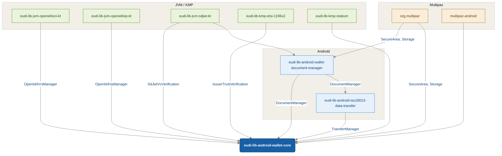

# EUDI Wallet Core library for Android

[](https://sonarcloud.io/summary/new_code?id=eu-digital-identity-wallet_eudi-lib-android-wallet-core)

**Important!** Before you proceed, please read
the [EUDI Wallet Reference Implementation project description](https://github.com/eu-digital-identity-wallet/.github/blob/main/profile/reference-implementation.md)

## Overview

The **Wallet Core** library acts as a coordinator by orchestrating the various components that are
required to implement the EUDI Wallet functionality. On top of that, it provides a simplified API
that can be used by the application to implement the EUDI Wallet functionality.

This repository is a **monorepo** that contains the EUDI Wallet Core library for Android along with
its companion libraries: **Document Manager** and **Transfer Manager**. All three modules are part of
the EUDI Wallet Reference Implementation project and are published under the same version.

**Note:** The `eudi-lib-android-wallet-document-manager` and
`eudi-lib-android-iso18013-data-transfer` libraries were previously maintained in separate
repositories. They have been consolidated into this monorepo for ease of maintenance. The
standalone repositories are no longer maintained — all development continues here.




### Features

The library supports the following features:

| Category                   | Feature                                                                 | Status                                                                                                                 |
|----------------------------|-------------------------------------------------------------------------|------------------------------------------------------------------------------------------------------------------------|
| **Document Management**    | Documents' Key creation and management with Android Keystore by default | ✅                                                                                                                      |
|                            | Custom Key Management implementation                                    | ✅ via implementation of SecureArea                                                                                     |
|                            | Multiple Key Management implementations                                 | ✅                                                                                                                      |
|                            | Support for Batch credentials per Document                              | ✅                                                                                                                      |
| **Document Issuance**      | OpenId4VCI v1.0 document issuance                                       |                                                                                                                        |
|                            | Authorization Code Flow                                                 | ✅                                                                                                                      |
|                            | Pre-authorization Code Flow                                             | ✅                                                                                                                      |
|                            | DPoP JWT in authorization                                               | ✅                                                                                                                      |
|                            | Credential Formats                                                      | ✅ mso_mdoc format <br /> ✅ sd-jwt-vc format                                                                            |
|                            | Credential issuance                                                     | ✅ Wallet initiated issuance  <br /> ✅ Via credential Offer                                                             |
|                            | Credential batch issuing                                                | ✅                                                                                                                      |
|                            | Credential reuse policies (ETSI TS 119 472-3)                           | ✅ once_only, limited_time, rotating_batch <br /> ⚠️ per_relying_party (partial — RP mapping planned)                     |
|                            | Deferred issuing                                                        | ✅                                                                                                                      |
|                            | Wallet Authentication                                                   | ✅ public client, <br/>✅ Attestation-Based Client Authentication (WIA)                                                  |
|                            | Supported Proof Types                                                   | ✅ Attestation Proof Type, <br/> ✅ Proof Type without Attestation <br/> ✅ JWT Proof Type with Attestation               |
|                            | Notify credential issuer                                                | ❌                                                                                                                      |
| **Issuer Trust**           | Trust verification during issuance (LoTE)                               | ✅ mso_mdoc format <br /> ✅ sd-jwt-vc format                                                                            |
|                            | Trust policy (ENFORCE / INFORM)                                         | ✅                                                                                                                      |
|                            | Signed issuer metadata verification                                     | ✅ RequireSigned (default) / PreferSigned / IgnoreSigned                                                                 |
|                            | Custom credential format verifiers                                      | ✅ via CredentialTrustVerifier                                                                                           |
| **Revocation Status**      | Document status resolution (token status lists)                         | ✅ JWT <br /> ✅ CWT                                                                                                     |
|                            | Status list token signer trust verification (LoTE)                      | ✅                                                                                                                      |
| **Proximity Presentation** | ISO-18013-5 device retrieval                                            |                                                                                                                        |
|                            | Device engagement                                                       | ✅ QR <br /> ✅ NFC                                                                                                      |
|                            | Data transfer                                                           | ✅ BLE <br /> ❌ NFC <br /> ❌ Wifi-Aware                                                                                 |
| **Remote Presentation**    | OpenID for Verifiable Presentations 1.0                                 |                                                                                                                        |
|                            | ClientID scheme                                                         | ✅ preregistered   <br /> ✅ x509_san_dns<br /> ✅ x509_hash <br /> ✅ redirect_uri                                        |
|                            | DCQL                                                                    | ✅ support for credential_sets  <br />✅ support for claim_sets <br />✅ per-query `multiple` flag <br />✅ per-query `require_cryptographic_holder_binding` flag |
|                            | Transaction data                                                        | ❌                                                                                                                      |

The library is written in Kotlin and is compatible with Java. It is distributed as a Maven package
and can be included in any Android project that uses Android 8 (API level 26) or higher.

### Repository Structure

This monorepo contains three Gradle modules, all published under the same version:

| Module | Maven Artifact |
|--------|----------------|
| `:wallet-core` | `eu.europa.ec.eudi:eudi-lib-android-wallet-core` |
| `:document-manager` | `eu.europa.ec.eudi:eudi-lib-android-wallet-document-manager` |
| `:transfer-manager` | `eu.europa.ec.eudi:eudi-lib-android-iso18013-data-transfer` |


## Disclaimer

The released software is an initial development release version:

- The initial development release is an early endeavor reflecting the efforts of a short timeboxed
  period, and by no means can be considered as the final product.
- The initial development release may be changed substantially over time, might introduce new
  features but also may change or remove existing ones, potentially breaking compatibility with your
  existing code.
- The initial development release is limited in functional scope.
- The initial development release may contain errors or design flaws and other problems that could
  cause system or other failures and data loss.
- The initial development release has reduced security, privacy, availability, and reliability
  standards relative to future releases. This could make the software slower, less reliable, or more
  vulnerable to attacks than mature software.
- The initial development release is not yet comprehensively documented.
- Users of the software must perform sufficient engineering and additional testing in order to
  properly evaluate their application and determine whether any of the open-sourced components is
  suitable for use in that application.
- We strongly recommend not putting this version of the software into production use.
- Only the latest version of the software will be supported

## Requirements

- Android 8 (API level 26) or higher

### Dependencies

To use snapshot versions add the following to your project's settings.gradle file:

```groovy

dependencyResolutionManagement {
    repositories {
        // ...
        maven {
            url = uri("https://central.sonatype.com/repository/maven-snapshots/")
            mavenContent { snapshotsOnly() }
        }
        // ...
    }
}
```

To include the library in your project, add the following dependencies to your app's build.gradle
file.

```groovy
dependencies {
    implementation "eu.europa.ec.eudi:eudi-lib-android-wallet-core:0.29.0"
    // required when using the built-in AndroidKeystoreSecureArea implementation provided by the library
    // for user authentication with biometrics
    implementation "androidx.biometric:biometric-ktx:1.2.0-alpha05"
}
```

## How to Use

### Initialize the library

To instantiate a `EudiWallet` use the `EudiWallet.Builder` class or the `EudiWallet.invoke` method,
from the EudiWallet companion object.

The minimum requirements to initialize the library is to provide a `EudiWalletConfig` object that
will be used to configure the library's built-in components.

The built-in components are:

- `AndroidKeystoreSecureArea` for storing and managing the documents' keys
- `AndroidStorage` for storing the documents' data
- `ReaderTrustStore` implementation for validating the reader's certificates
- `PresentationManager` implementation for managing both proximity and remote presentation of
  documents
- `Logger` implementation for logging
- `DocumentStatusResolver` implementation for checking document revocation status

The following example demonstrates how to initialize the library for using the built-in components:

```kotlin
// configuring the wallet
val storageFile = File(applicationContext.noBackupFilesDir.path, "main.db")
val config = EudiWalletConfig()
    // configure the document storage
    // the noBackupFilesDir is used to store the documents by default
    .configureDocumentManager(storageFile.absolutePath)
    // configure the built-in logger
    .configureLogging(
        // set log level to info
        level = Logger.LEVEL_INFO
    )
    // configure the built-in key creation settings
    .configureDocumentKeyCreation(
        // set userAuthenticationRequired to true to require user authentication
        userAuthenticationRequired = true,
        // set userAuthenticationTimeout to 30 seconds
        userAuthenticationTimeout = 30_000.milliseconds,
        // set useStrongBoxForKeys to true to use the device's StrongBox if available
        // to store the keys
        useStrongBoxForKeys = true
    )
    .configureReaderTrustStore(
        // set the reader trusted certificates for the reader trust store
        listOf(readerCertificate)
    )
    // configure the reader authentication enforcement policy
    // default is EnforceIfPresent
    .configureReaderAuthPolicy(ReaderAuthPolicy.EnforceIfPresent)
    // configure the OpenId4Vci service
    .configureOpenId4Vci {
        withIssuerUrl("https://issuer.com")
        withClientAuthenticationType(OpenId4VciManager.ClientAuthenticationType.AttestationBased)
        withAuthFlowRedirectionURI("eudi-openid4ci://authorize")
        withParUsage(OpenId4VciManager.Config.ParUsage.Companion.IF_SUPPORTED)
        // Configure DPoP (Demonstrating Proof-of-Possession)
        // By default, DPoP is enabled with DPopConfig.Default
        // You can also provide a custom configuration or disable it
        // withDPopConfig(DPopConfig.Default) // This is the default
        // withDPopConfig(DPopConfig.Disabled) // To disable DPoP
        // withDPopConfig(customDPopConfig) // To use custom configuration

        // Configure credential response encryption
        // By default, encryption is REQUIRED with EC P-256 and RSA 2048
        // withResponseEncryptionConfig(EncryptionSupportConfig(...))
    }
    // configuration for proximity presentation
    // the values below are the default values
    .configureProximityPresentation(
        // ble mode: peripheral and/or central
        enableBlePeripheralMode = true,
        enableBleCentralMode = false,
        clearBleCache = true,
        // registered application service for handling NFC device engagement
        nfcEngagementServiceClass = MyNfcEngagementService::class.java
    )
    // configure the OpenId4Vp service
    .configureOpenId4Vp {
        withClientIdSchemes(
            ClientIdScheme.X509SanDns
        )
        withSchemes(
            "openid4vp",
            "eudi-openid4vp",
            "mdoc-openid4vp"
        )
        withFormats(
            Format.MsoMdoc.ES256,
            Format.SdJwtVc.ES256
        ) 
        // Encryption policy — defaults to EncryptionPolicy.HAIP, which accepts only
        // encrypted response modes (`direct_post.jwt` for OpenID4VP, `dc_api.jwt` for DC-API). 
        // Override via withEncryptionPolicy(...) if a different profile is needed.
        withEncryptionPolicy(EncryptionPolicy.HAIP)
        
    }
    // configure document status resolver with 5 minutes clock skew tolerance
    .configureDocumentStatusResolver(clockSkewInMinutes = 5)

// Create the wallet instance with default components
val wallet = EudiWallet(context, config)

// Or create the wallet with custom component implementations
val customWallet = EudiWallet(context, config) {
    // custom Storage to store documents' data
    withStorage(myStorage)
    // a list of SecureArea implementations to be used
    withSecureAreas(listOf(deviceSecureArea, cloudSecureArea))
    // ReaderTrustStore to be used for reader authentication
    withReaderTrustStore(myReaderTrustStore)
    // custom logger to be used
    withLogger(myLogger)
    // custom HTTP client for network operations
    withKtorHttpClientFactory { HttpClient(OkHttp) { /* custom config */ } }
    // custom transaction logger for auditing
    withTransactionLogger(myTransactionLogger)
    // custom document status resolver
    withDocumentStatusResolver(myDocumentStatusResolver)
    // custom wallet key manager
    withWalletKeyManager(myWalletKeyManager)
}
```

See the [CustomizeSecureArea.md](CustomizeSecureArea.md) for more information on how to use the
wallet-core library with custom SecureArea implementations.

#### Reader Authentication Policy

The reader authentication policy controls how reader authentication results affect document
disclosure during proximity (BLE/NFC) and DCAPI presentations. This works in conjunction with the
`ReaderTrustStore` configured via `configureReaderTrustStore`.

When a verifier's DeviceRequest includes reader authentication, the wallet verifies the reader's
certificate chain against the configured `ReaderTrustStore`. The `ReaderAuthPolicy` determines what
happens based on the verification result:

| Policy | Behavior |
|---|---|
| `ReaderAuthPolicy.DoNotEnforce` | Reader authentication is evaluated but never blocks document disclosure. Documents are always included in the response. |
| `ReaderAuthPolicy.EnforceIfPresent` | **(Default)** Documents are excluded from the response when reader authentication is present but fails verification. Documents without reader authentication are included normally. |
| `ReaderAuthPolicy.AlwaysRequire` | Documents are excluded unless reader authentication is present and verified successfully. |

Per ISO 18013-5, when all documents are excluded due to reader authentication failure, the wallet
returns a DeviceResponse with status 10 (General Error) instead of an empty success response.

The reader auth policy can be set in two ways, for flexibility:

**Inside the ETSI reader trust DSL** (when using `configureEtsiTrust`):

```kotlin
val config = EudiWalletConfig {
    configureEtsiTrust { /* ... */ }
    configureReaderTrustStore {
        readerAuthPolicy(ReaderAuthPolicy.AlwaysRequire)
    }
}
```

**As a standalone call** (when using certificate-based or custom `ReaderTrustStore`):

```kotlin
val config = EudiWalletConfig {
    configureReaderTrustStore(listOf(trustedReaderCertificate))
    configureReaderAuthPolicy(ReaderAuthPolicy.EnforceIfPresent)
}
```

The standalone `configureReaderAuthPolicy()` method remains available for users who use the
certificate-based `configureReaderTrustStore(certificates)` overloads or a custom `ReaderTrustStore`,
since those paths don't have a DSL block.

> **Note:** If a verifier includes reader authentication in its request but its certificate is not in
> the configured `ReaderTrustStore`, the document will be excluded from the response when using
> `EnforceIfPresent` or `AlwaysRequire` policies. To allow presentations to verifiers whose
> certificates are not in the trust store, use `ReaderAuthPolicy.DoNotEnforce`.

#### WalletKeyManager Configuration
This interface is responsible for managing Attestation Keys used during Attestation Based Client Authentication with OpenId4Vci.
The library provides `SecureAreaWalletKeyManager`, an extensible SecureArea based implementation of this interface.
If no configuration is provided for a custom `WalletKeyManager` the default implementation of the library will be used based on `AndroidKeystoreSecureArea`.
You can provide your custom `WalletKeyManager` by configuring the `EudiWallet` instance:
```kotlin
val customWallet = EudiWallet(context, config) {
    // rest of configurations
    // ......................
    // custom wallet key manager
    withWalletKeyManager(myWalletKeyManager)
}
```

#### Configure EudiWallet for Attestation Based Client Authentication(WIA) and Wallet Unit Attestation(WUA) with a Wallet Provider
The wallet-core supports Wallet Instance Attestation (WIA) that attests the integrity of the app & Wallet Unit Attestation (WUA) that attests the security of keys stored in the Wallet Unit.
You can optionally configure your wallet with this capability by implementing the core's `WalletAttestationsProvider` interface which bridges your wallet-specific Wallet Provider to the core.
Example usage is documented below:
```kotlin
val walletAttestationsProvider = object : WalletAttestationsProvider {
    /**
     * WIA (Wallet Instance Attestation)
     * Used for Client Authentication (OAuth 2.0).
     */
    override suspend fun getWalletAttestation(keyInfo: KeyInfo) : Result<String> {
        //  Make a network call to your Wallet Provider Service.
        //  Send the public key from 'keyInfo' (PoP key).
        //  Prove app integrity
        // Return the "Client Attestation JWT" signed by your Provider. 
        return Result.success("ey...<The_WIA_JWT>")
    }

    /**
     * WUA (Wallet Unit Attestation)
     * Used to authorize Credential Issuance.
     */
    override suspend fun getKeyAttestation(keys: List<KeyInfo>, nonce: Nonce?) : Result<String> {
        // Make a network call to your Wallet Provider Service.
        // Send the public keys (from 'keys') intended for the new Credential.
        // Provide the 'nonce' if required by the Issuer.
        // Return the "Wallet Unit Attestation" (or Key Attestation) JWT.
        // This certifies that these specific keys are hardware-bound and trusted.
        return Result.success("ey...<The_WUA_JWT>")
    }
}
```

So the configuration of the EudiWallet documented in the above section would now be:
```kotlin
val wallet = EudiWallet(
    context,
    config,
    walletAttestationsProvider
)
```

**NOTE:** When Attestation Based Client Authentication is configured for OpendId4Vci, the `EudiWallet` must also be instantiated with a WalletProvider


### Manage documents

The library provides a set of methods to work with documents.

#### Retrieving documents

The following snippet shows how to retrieve all documents:

```kotlin
// Get all documents in the wallet
val documents = wallet.getDocuments()
```

You can also retrieve documents based on a predicate. The following snippet shows how to retrieve
documents of mso_mdoc format of a specific docType:

```kotlin
// Get documents filtered by a specific docType
val documents = wallet.getDocuments { document ->
    (document.format as? MsoMdocFormat)?.docType == "eu.europa.ec.eudi.pid.1"
}

// Get only issued documents (excluding deferred documents)
val issuedDocuments = wallet.getDocuments { document ->
    document is IssuedDocument
}

// Combine multiple conditions
val specificDocuments = wallet.getDocuments { document ->
    document is IssuedDocument &&
            (document.format as? SdJwtVcFormat)?.vct == "IdentityCredential"
}
```

The following snippet shows how to retrieve a document by its id:

```kotlin
val documentId = "some_document_id"
val document: Document? = wallet.getDocumentById(documentId)

// You can also cast to a specific document type if needed
val issuedDocument = wallet.getDocumentById(documentId) as? IssuedDocument
val deferredDocument = wallet.getDocumentById(documentId) as? DeferredDocument
```

##### Working with Credentials in Issued Documents

Issued documents provide methods to work with individual credentials:

```kotlin
val issuedDocument = documentManager.getDocumentById("document_id") as? IssuedDocument
requireNotNull(issuedDocument)

// Get the number of valid credentials for the document
val numberOfValidCredentials = issuedDocument.credentialsCount()

// Get the initial number of credentials for the document
val initialNumberOfCredentials = issuedDocument.initialCredentialsCount()

// Get a list of all valid credentials for the document
val validCredentials = issuedDocument.getCredentials()

// Find an available credential (automatically selects the best one based on policy)
val credential = issuedDocument?.findCredential()

// Use a credential and apply the policy (e.g., delete if OnceOnly, increment usage if RotatingBatch)
issuedDocument?.consumingCredential {
    // Use the credential for presentation or other operations
    // The credential policy will be applied automatically after this block
    performPresentationWithCredential(this)
}
```

The `findCredential()` method intelligently selects credentials based on:

- Credential policy (e.g., [ETSI reuse policies](#credential-reuse-policies-etsi-ts-119-472-3) such as `OnceOnly`, `LimitedTime`, `RotatingBatch`)
- Usage count (selecting least-used credentials first in rotation-based policies)
- Validity period (ensuring the credential is currently valid)
- Availability (excluding deleted or invalidated credentials)

#### Deleting documents

To delete a document, use the following code snippet:

```kotlin
try {
    val documentId = "some_document_id"
    val deleteResult = wallet.deleteDocumentById(documentId)
    deleteResult.getOrThrow()
} catch (e: Throwable) {
    // Handle the exception
}
```

#### Resolving document status

The wallet-core library provides functionality to check the revocation status of documents. This is
useful to verify if a document is still valid or has been revoked.

To check the status of a document, you can use the `resolveStatusById` method on the `EudiWallet`
instance:

```kotlin
// Get a document's ID
val documentId = "some_document_id"

// Check the document's status
wallet.resolveStatusById(documentId).fold(
    onSuccess = { status ->
        when (status) {
            Status.Valid -> println("Document is valid")
            Status.Invalid -> println("Document is invalid")
            Status.Suspended -> println("Document is suspended")
            is Status.ApplicationSpecific -> println("Application-specific status: ${status.value}")
            is Status.Reserved -> println("Reserved status: ${status.value}")
        }
    },
    onFailure = { error ->
        // Handle errors (network issues, document not found, etc.)
    }
)
```

You can also check the status of a document directly if you have an `IssuedDocument` instance:

```kotlin
val document = wallet.getDocumentById(documentId) as? IssuedDocument
if (document != null) {
    wallet.resolveStatus(document).fold(
        onSuccess = { status ->
            // Handle the status
        },
        onFailure = { error ->
            // Handle errors
        }
    )
}
```

For more details on document management, see
the [Document Manager repository](https://github.com/eu-digital-identity-wallet/eudi-lib-android-wallet-document-manager/blob/v0.11.1/README.md).

##### Document Status Resolution Configuration

By default, the library uses a built-in implementation of `DocumentStatusResolver` that works with
token status lists as specified in various credential formats. The resolver supports both MSO MDOC
and SD-JWT VC document formats.

###### Basic Configuration

You can configure the default implementation using `EudiWalletConfig`:

```kotlin
val config = EudiWalletConfig()
    // Configure a clock skew allowance (in minutes) for token verification
    .configureDocumentStatusResolver(clockSkewInMinutes = 5)
// ... other configurations
```

###### Custom DocumentStatusResolver Implementation

For more advanced customization, you can provide your own custom implementation of
`DocumentStatusResolver` during wallet initialization:

```kotlin
val wallet = EudiWallet(context, config) {
    // Custom HTTP client factory for status resolution if needed
    withKtorHttpClientFactory { HttpClient(OkHttp) { /* custom configuration */ } }

    // Or a completely custom document status resolver
    withDocumentStatusResolver(myCustomDocumentStatusResolver)
}
```

You can also create your own DocumentStatusResolver using the builder:

```kotlin
// Create a custom DocumentStatusResolver
val customResolver = DocumentStatusResolver {
    // Configure verification mechanism
    withVerifySignature(VerifyStatusListTokenSignature.x5c)

    // Configure clock skew tolerance
    withAllowedClockSkew(Duration.minutes(5))

    // Custom HTTP client factory
    withKtorHttpClientFactory {
        HttpClient(CIO) {
            // Custom client configuration 
        }
    }

    // Custom status reference extractor if needed
    withExtractor(MyCustomStatusReferenceExtractor)
}

// Use the custom resolver during wallet initialization
val wallet = EudiWallet(context, config) {
    withDocumentStatusResolver(customResolver)
}
```

### Trusted Lists

The library supports trust verification using ETSI Trusted Lists for **credential issuance**
(issuer trust), **credential presentation** (reader/verifier authentication), **revocation
status** (status list token signer trust), and **signed issuer metadata** verification. This
enables dynamic trust anchor resolution from LoTE (ETSI TS 119 602) instead of static
certificate lists.

The recommended approach is to use `configureEtsiTrust` to centralize the LoTE trust
infrastructure in the core. This builds the entire trust pipeline internally — HTTP client,
file cache, JWT signature verification, trust anchor provisioning, and caching — from a
small set of high-level configuration knobs. Each trust area (`configureIssuerTrust`,
`configureDocumentStatusResolver`, `configureReaderTrustStore`) inherits the shared trust
source automatically and only needs area-specific settings (policies, clock skew, etc.).

Each trust verification feature is independently configurable and opt-in. When not configured,
the library behaves as before (credentials stored without trust checks, status resolved with
standard signature verification, reader authentication via static certificate lists or
disabled, unsigned metadata only).

For advanced use cases, the design remains **protocol-agnostic** — the per-area builders still
accept explicit `trustSource()` calls, allowing developers to compose trust validation using the
[eudi-lib-kmp-etsi1196x2](https://github.com/eu-digital-identity-wallet/eudi-lib-kmp-etsi-1196x2)
library directly (or any other trust framework).

#### Dependencies

The `etsi-1196x2-consultation` module is exposed as an `api` dependency from wallet-core,
so consumers can reference its types directly (`SupportedLists`, `AttestationClassifications`,
`IsChainTrustedForEUDIW`, etc.).

The `etsi-119602-consultation` module (which provides the `Uri` type used in `configureEtsiTrust`
DSL) is **not** transitively available due to an upstream packaging issue. Consumers must
declare it explicitly:

```groovy
dependencies {
    implementation "eu.europa.ec.eudi:eudi-lib-android-wallet-core:0.29.0"
    // Required explicitly — Uri type is not transitive from wallet-core
    implementation "eu.europa.ec.eudi:eudi-lib-kmp-etsi-119602-consultation:${VERSION}"
}
```

#### Centralized Trust Configuration (`configureEtsiTrust`)

The `configureEtsiTrust` DSL centralizes the entire LoTE pipeline setup into a few high-level
knobs. The core builds the HTTP client, file cache, JWT signature verifier, trust anchor
provisioner, and in-memory cache internally. Each trust area inherits the shared trust source
and classifications automatically.

```kotlin
val config = EudiWalletConfig {
    configureEtsiTrust {
        // Required: LoTE download URLs
        loteLocations(SupportedLists(
            pidProviders = Uri("https://trust.example.eu/pid-providers.jwt"),
            wrpacProviders = Uri("https://trust.example.eu/wrpac-providers.jwt"),
            pubEaaProviders = Uri("https://trust.example.eu/pub-eaa-providers.jwt")
        ))

        // Required: map credential types to ETSI verification contexts
        classifications(AttestationClassifications(
            pids = AttestationIdentifierPredicate.any(setOf(
                AttestationIdentifier.MDoc("eu.europa.ec.eudi.pid.1"),
                AttestationIdentifier.SDJwtVc("urn:eudi:pid:1"),
            )),
            pubEAAs = AttestationIdentifierPredicate.equalsTo(
                AttestationIdentifier.MDoc("org.iso.18013.5.1.mDL")
            ),
        ))

        // Optional: all have sensible defaults
        fileCacheExpiration(24.hours)    // how long LoTE files are cached on disk
        cacheTtl(20.minutes)             // how long trust anchors are cached in memory
        relaxCertificateProfiles()       // strip endEntityProfile constraints (DEV/testing)
        relaxPkixRevocation()            // disable PKIX revocation checks (DEV/testing)
        // jwtSignatureVerifier(custom)  // override built-in JWT verifier
        // loteConstraints(...)          // control LoTE pointer following
    }

    // Each area inherits trust source + classifications from configureEtsiTrust.
    // Only area-specific settings are needed:
    configureIssuerTrust {
        policy { default(TrustPolicy.Action.ENFORCE) }
    }
    configureDocumentStatusResolver {
        clockSkew(5)
    }
    configureReaderTrustStore {
        readerAuthPolicy(ReaderAuthPolicy.AlwaysRequire)
    }
}
```

> **LoTE JWT Verification:** The built-in `LoteJwtVerifier` only performs **cryptographic
> signature verification** — it extracts the `x5c` chain from the JWT header and verifies
> the JWS signature using the leaf certificate's public key (EC and RSA supported). It does
> **not** perform certificate chain validation (PKIX), CRL/OCSP revocation checking, or
> certificate profile constraint checks on the signing certificate. These additional trust
> checks will be added in a future release. To provide a custom implementation with
> thorough verification, pass it via `jwtSignatureVerifier()`.
>
> **DEV/Testing knobs:** `relaxCertificateProfiles()` strips `endEntityProfile` constraints
> from all provider types, useful when DEV certificates don't fully conform to ETSI profile
> requirements. `relaxPkixRevocation()` disables CRL/OCSP revocation checks when endpoints
> are not available in the test environment. When `relaxPkixRevocation()` is **not** called,
> PKIX revocation checking is enabled and strict — certificate chain validation will fail if
> a certificate is revoked or if the revocation status cannot be determined.

#### Advanced: Manual Trust Anchor Resolution (LoTE)

For advanced use cases where you need full control over the LoTE pipeline, you can build
the trust source manually using the ETSI library directly and pass it to the per-area
builders via `trustSource()`:

```kotlin
// 1. Set up LoTE loading with file cache
val httpClient = HttpClient()
val loadLoTE = LoadSingleLoTEWithFileCache(
    cacheDirectory = Path(context.cacheDir.path, "lote-cache"),
    downloadSingleLoTE = DownloadSingleLoTE(httpClient),
    fileCacheExpiration = 24.hours,
)

// 2. Configure LoTE pointer loading and JWT verification
val loadLoTEAndPointers = LoadLoTEAndPointers(
    constraints = LoadLoTEAndPointers.Constraints.DoNotLoadOtherPointers,
    verifyJwtSignature = myJwtVerifier, // Your VerifyJwtSignature implementation
    loadLoTE = loadLoTE,
)

// 3. Build trust anchor provisioner with EU defaults
val provisionTrustAnchors = ProvisionTrustAnchorsFromLoTEs.eudiwJvm(loadLoTEAndPointers)

// 4. Create cached trust validator
val disposableScope = DisposableContainer()
val isChainTrusted = provisionTrustAnchors.cached(disposableScope, loteLocations, ttl = 10.minutes)

// 5. Pass to each area explicitly
val config = EudiWalletConfig {
    configureIssuerTrust {
        trustSource(isChainTrusted)
        classifications(myClassifications)
        policy { default(TrustPolicy.Action.ENFORCE) }
    }
    configureDocumentStatusResolver {
        clockSkew(5)
        configureTrust {
            trustSource(isChainTrusted)
            classifications(myClassifications)
        }
    }
    configureReaderTrustStore(isChainTrusted)
}

// On shutdown:
// disposableScope.dispose()
```

> **Lifecycle:** When building the pipeline manually, `DisposableContainer` manages cached
> resources. Create it at Application scope and call `dispose()` during shutdown. When using
> `configureEtsiTrust`, the core manages the lifecycle internally.
>
> **HTTP Client:** `HttpClient()` with no explicit engine auto-discovers `ktor-client-android` at
> runtime (already included as a `runtimeOnly` dependency by wallet-core).

#### Issuer Trust Verification

Trust verification runs after the credential is received from the issuer and before it is stored.
Built-in verifiers handle both MsoMdoc and SD-JWT VC formats, and custom verifiers can be
registered for additional formats. When issuer trust is not configured, verification is skipped
entirely and credentials are stored as before.

Enable issuer trust verification via the `configureIssuerTrust` DSL on `EudiWalletConfig`.
When `configureEtsiTrust` is also used, `trustSource()` and `classifications()` are inherited
automatically — only policy and metadata settings are needed:

```kotlin
val walletConfig = EudiWalletConfig {
    configureEtsiTrust { /* ... */ }

    configureIssuerTrust {
        // trustSource() and classifications() inherited from configureEtsiTrust
        policy {
            default(TrustPolicy.Action.ENFORCE)
            forContext(VerificationContext.EAA("experimental"), TrustPolicy.Action.INFORM)
            forDocType("org.example.test", TrustPolicy.Action.INFORM)
        }
        // Signed metadata verification defaults to RequireSigned (see below)
        // override by calling preferSignedMetadata() or ignoreSignedMetadata()
    }
}
```

When not using `configureEtsiTrust`, provide the trust source explicitly:

```kotlin
configureIssuerTrust {
    trustSource(isChainTrusted) // manually built IsChainTrustedForEUDIW
    classifications(myClassifications) // AttestationClassifications from ETSI library
    policy { default(TrustPolicy.Action.ENFORCE) }
}
```

- **`trustSource`** -- sets the trust anchor source. Accepts a `ComposeChainTrust`,
  `IsChainTrustedForEUDIW`, or a pre-built `IsChainTrustedForAttestation`.
  Optional when `configureEtsiTrust` is configured.
- **`classifications`** -- required when using `ComposeChainTrust` or `IsChainTrustedForEUDIW`
  as the trust source. Maps credential types to verification contexts.
- **`policy`** -- configures how the wallet acts on trust results (see below).
- **`preferSignedMetadata()`** / **`ignoreSignedMetadata()`** -- relaxes the default
  `RequireSigned` metadata policy (see [Signed Issuer Metadata Verification](#signed-issuer-metadata-verification)).

##### Trust Policies

A `TrustPolicy` determines the action taken when an issuer is not trusted:

| Action    | Behaviour                                                                   |
|-----------|-----------------------------------------------------------------------------|
| `ENFORCE` | Reject the credential -- delete it and emit `IssueEvent.DocumentFailed`.    |
| `INFORM`  | Store the credential regardless and attach the result to `DocumentIssued`.  |

The default policy is `ENFORCE` for all credentials. Use the `policy` DSL to override per
verification context or per attestation type. Resolution order (highest priority first):

1. Per-attestation overrides (`forDocType`, `forVct`, `forAttestation`)
2. Per-context overrides (`forContext`)
3. Default action (`default`)

##### Handling Trust Results

The trust verification result is available on `IssueEvent.DocumentIssued` and
`IssueEvent.DocumentFailed`:

```kotlin
manager.issueDocumentByOfferUri(offerUri) { event ->
    when (event) {
        is IssueEvent.DocumentIssued -> {
            when (event.issuerTrustResult) {
                is CertificationChainValidation.Trusted -> {
                    // Issuer is trusted
                }
                is CertificationChainValidation.NotTrusted -> {
                    // INFORM policy: credential stored, but issuer was not trusted
                }
                null -> {
                    // Trust verification not configured
                }
            }
        }
        is IssueEvent.DocumentFailed -> {
            if (event.cause is IssuerNotTrustedException) {
                // ENFORCE policy: credential rejected because issuer was not trusted
                Log.w("Trust", "Issuer not trusted", event.cause)
            }
        }
        else -> Unit
    }
}
```

##### Custom CredentialTrustVerifier

The library includes built-in verifiers for MsoMdoc and SD-JWT VC formats. To support
additional credential formats, implement the `CredentialTrustVerifier` interface and register
it during configuration:

```kotlin
class MyCustomVerifier(
    private val isChainTrusted: IsChainTrustedForAttestation<List<X509Certificate>, TrustAnchor>,
) : CredentialTrustVerifier {
    override suspend fun verify(
        credentialValue: String,
        attestationIdentifier: AttestationIdentifier,
    ): CertificationChainValidation<TrustAnchor>? {
        // Extract certificate chain from the credential and evaluate trust
        // Return null if the chain cannot be extracted
    }
}

// Register during configuration
configureIssuerTrust {
    trustSource(myComposeChainTrust)
    classifications(myClassifications)
    credentialTrustVerifier(MyCustomFormat::class, MyCustomVerifier(isChainTrusted))
}
```

#### Signed Issuer Metadata Verification

The library supports verifying signed issuer metadata (JWT type `openidvci-issuer-metadata+jwt`)
as defined in OpenID4VCI. When an issuer provides signed metadata, the library extracts the x5c
certificate chain from the JWT header and validates it against the configured trust source.

Three metadata policies are available:

| Policy            | Behaviour                                                                                      |
|-------------------|------------------------------------------------------------------------------------------------|
| `RequireSigned`   | **(Default)** Signed metadata must be available and its certificate chain must be trusted. Otherwise issuance fails. |
| `PreferSigned`    | Attempts to fetch signed metadata first. Falls back to unsigned if signed is not available. When signed metadata is served but the certificate chain is untrusted, issuance **fails**. |
| `IgnoreSigned`    | Signed metadata is ignored; only unsigned metadata is used. Must be set explicitly via `ignoreSignedMetadata()`. |

When `configureIssuerTrust` is used with an `IsChainTrustedForEUDIW` trust source (the
standard LoTE setup), signed metadata verification defaults to `RequireSigned`. The library
automatically creates the trust adapter using
`VerificationContext.WalletRelyingPartyAccessCertificate`.

To override the default metadata policy:

```kotlin
configureIssuerTrust {
    trustSource(isChainTrusted)
    classifications(myClassifications)
    policy { default(TrustPolicy.Action.ENFORCE) }

    // Prefer signed, but fall back to unsigned if not available
    preferSignedMetadata()

    // Or explicitly disable signed metadata verification
    // ignoreSignedMetadata()
}
```

> **Note:** Metadata verification is a separate check from credential trust verification.
> Metadata trust runs **before** credential issuance (during offer resolution / issuer metadata
> fetch), while credential trust runs **after** the credential is received. Both are independent
> and can be configured separately.

#### Revocation Status Trust Verification

The document status resolver can optionally verify that the signer of status list tokens (JWT
or CWT) is trusted according to ETSI trusted lists. This adds an additional layer of trust
beyond the default cryptographic signature verification (x5c/COSE_X509).

Configure status list trust within the `configureDocumentStatusResolver` DSL. When
`configureEtsiTrust` is used, the trust source and classifications are inherited — only
clock skew and optional policy overrides are needed:

```kotlin
val walletConfig = EudiWalletConfig {
    configureEtsiTrust { /* ... */ }

    configureDocumentStatusResolver {
        clockSkew(5) // minutes
        // Trust source and classifications inherited from configureEtsiTrust.
        // Optionally override policy:
        configureTrust {
            policy {
                default(TrustPolicy.Action.INFORM)
            }
        }
    }
}
```

When not using `configureEtsiTrust`, provide the trust source explicitly inside `configureTrust`:

```kotlin
configureDocumentStatusResolver {
    clockSkew(5)
    configureTrust {
        trustSource(isChainTrusted) // manually built trust source
        classifications(myClassifications)
        policy { default(TrustPolicy.Action.INFORM) }
    }
}
```

The `configureTrust` block accepts the same DSL as issuer trust (`trustSource`,
`classifications`, `policy`). The trust policy determines the action when the status list
token signer is not trusted:

| Action    | Behaviour                                                                          |
|-----------|------------------------------------------------------------------------------------|
| `ENFORCE` | Reject the status result — treat the document's revocation status as unknown.      |
| `INFORM`  | Accept the status result regardless and let the application decide.                |

When status list trust is not configured, the resolver falls back to standard x5c / COSE_X509
signature verification without ETSI trust chain validation.

#### Reader Authentication with Trusted Lists

`EtsiReaderTrustStore` is a drop-in replacement for `ReaderTrustStoreImpl` that delegates
reader certificate chain validation to the ETSI library's `IsChainTrustedForEUDIW`. It
uses the `WalletRelyingPartyAccessCertificate` (WRPAC) verification context by default.

**Using centralized ETSI trust** (recommended): The DSL block inherits the trust source from
`configureEtsiTrust` and allows setting the reader authentication policy in the same place:

```kotlin
val config = EudiWalletConfig {
    configureEtsiTrust { /* ... */ }

    configureReaderTrustStore {
        readerAuthPolicy(ReaderAuthPolicy.AlwaysRequire)
    }
}
```

**Using a manually built trust source**: Pass `IsChainTrustedForEUDIW` directly. The reader
auth policy is set separately via `configureReaderAuthPolicy()`:

```kotlin
val config = EudiWalletConfig {
    configureReaderTrustStore(isChainTrusted)
    configureReaderAuthPolicy(ReaderAuthPolicy.AlwaysRequire)
}
```

**Using static certificates**: The overloads that accept `X509Certificate` lists remain
available. The reader auth policy is set separately, and the certificate revocation checking
policy can be configured via the `revocationPolicy` parameter (defaults to
`RevocationPolicy.HardFail`):

```kotlin
val config = EudiWalletConfig {
    configureReaderTrustStore(
        listOf(trustedCert1, trustedCert2),
        revocationPolicy = RevocationPolicy.SoftFail
    )
    configureReaderAuthPolicy(ReaderAuthPolicy.EnforceIfPresent)
}
```

The available revocation policies are:

| Policy | Behavior |
|---|---|
| `RevocationPolicy.HardFail` | **(Default)** Validation fails if a certificate is revoked **or** if the CRL/OCSP responder cannot be reached. |
| `RevocationPolicy.SoftFail` | Validation fails if a certificate is revoked, but tolerates CRL/OCSP unavailability. |
| `RevocationPolicy.NoCheck` | No revocation checking is performed. |

> **Note:** `RevocationPolicy` only applies to the static certificate-based `configureReaderTrustStore`
> overloads. When using ETSI/LoTE-based trust (via `configureEtsiTrust`), revocation checking is
> controlled by `relaxPkixRevocation()` inside the `configureEtsiTrust` block instead.

For advanced use cases requiring a specific verification context, create an
`EtsiReaderTrustStore` explicitly:

```kotlin
val readerTrustStore = EtsiReaderTrustStore(
    isChainTrusted = isChainTrusted,
    verificationContext = VerificationContext.WalletRelyingPartyAccessCertificate,
)

val config = EudiWalletConfig {
    configureReaderTrustStore(readerTrustStore)
}
```

You can also update the reader trust store at runtime:

```kotlin
wallet.setReaderTrustStore(EtsiReaderTrustStore(isChainTrusted))
```

> **Note:** For best performance during presentations, pre-warm the ETSI cache on app startup.
> This ensures that trust anchors are already resolved and cached before the first reader
> authentication occurs.

#### Full Configuration Example

The following example shows a complete `EudiWallet` setup with issuer trust verification,
signed metadata verification, revocation status trust, and reader authentication — all
using `configureEtsiTrust` to centralize the shared LoTE infrastructure:

```kotlin
val config = EudiWalletConfig {
    configureOpenId4Vci {
        withIssuerUrl("https://issuer.example.com")
        withClientAuthenticationType(OpenId4VciManager.ClientAuthenticationType.AttestationBased)
        withAuthFlowRedirectionURI("eudi-openid4ci://authorize")
    }
    configureOpenId4Vp {
        withClientIdSchemes(ClientIdScheme.X509SanDns)
        withSchemes("openid4vp", "eudi-openid4vp", "mdoc-openid4vp")
        // Encryption policy — defaults to EncryptionPolicy.HAIP, which accepts only
        // encrypted response modes (`direct_post.jwt` for OpenID4VP, `dc_api.jwt` for DC-API). 
        // Override via .withEncryptionPolicy(...) if a different profile is needed.
        withEncryptionPolicy(EncryptionPolicy.HAIP)
    }

    // Centralized ETSI trust — builds the full LoTE pipeline internally
    configureEtsiTrust {
        loteLocations(SupportedLists(
            pidProviders = Uri("https://trust.example.eu/pid-providers.jwt"),
            wrpacProviders = Uri("https://trust.example.eu/wrpac-providers.jwt"),
        ))
        classifications(AttestationClassifications(
            pids = AttestationIdentifierPredicate.any(setOf(
                AttestationIdentifier.MDoc("eu.europa.ec.eudi.pid.1"),
                AttestationIdentifier.SDJwtVc("urn:eudi:pid:1"),
            )),
            pubEAAs = AttestationIdentifierPredicate.equalsTo(
                AttestationIdentifier.MDoc("org.iso.18013.5.1.mDL")
            ),
        ))
        // DEV/testing relaxations (omit in production):
        // relaxCertificateProfiles()
        // relaxPkixRevocation()
    }

    // Issuer trust — trust source + classifications inherited from configureEtsiTrust
    // Signed metadata verification defaults to RequireSigned
    configureIssuerTrust {
        policy {
            default(TrustPolicy.Action.ENFORCE)
        }
    }

    // Revocation status trust — trust source + classifications inherited
    configureDocumentStatusResolver {
        clockSkew(5)
    }

    // Reader authentication — trust source inherited, policy set inline
    configureReaderTrustStore {
        readerAuthPolicy(ReaderAuthPolicy.EnforceIfPresent)
    }
}
```

### Issue document using OpenID4VCI

The library provides issuing documents using OpenID4VCI protocol. To issue a document
using this functionality, EudiWallet must be initialized with the `openId4VciConfig` configuration,
during configuration. See the [Initialize the library](#initialize-the-library) section.

To validate issuer trust before storing credentials, see [Trusted Lists](#trusted-lists).

#### Creating an OpenId4VciManager

First, you need an instance of the `OpenId4VciManager` class. You can create an instance of the
class by calling the `EudiWallet.createOpenId4VciManager` method:

```kotlin
// Create an instance of OpenId4VciManager using wallet-wide configuration
val openId4VciManager = wallet.createOpenId4VciManager()

// Or provide a specific configuration for this instance
val customConfig = OpenId4VciManager.Config.Builder()
    .withIssuerUrl("https://custom-issuer.com")
    .withClientAuthenticationType(OpenId4VciManager.ClientAuthenticationType.AttestationBased)
    .withAuthFlowRedirectionURI("eudi-openid4ci://custom-authorize")
    .withSupportedCredentialReusePolicies(
        CredentialReusePolicies.Supported(
            setOf(EudiReusePolicyType.OnceOnly, EudiReusePolicyType.LimitedTime)
        )
    )
    .build()

val openId4VciManagerWithCustomConfig = wallet.createOpenId4VciManager(customConfig)

// You can also provide a custom HTTP client factory
val openId4VciManagerWithCustomHttpClient = wallet.createOpenId4VciManager(
    config = customConfig,
    ktorHttpClientFactory = {
        HttpClient(OkHttp) {
            // Custom HTTP client configuration
        }
    }
)
```

**NOTE:** When `withClientAuthenticationType(OpenId4VciManager.ClientAuthenticationType.AttestationBased)` is configured, the `EudiWallet` must also be instantiated with a WalletProvider

##### How configuration is resolved

The `createOpenId4VciManager` method can accept an optional `OpenId4VciManager.Config` parameter:

1. If you provide a configuration parameter, that configuration will be used for the created manager
   instance.
2. If you don't provide a configuration parameter, the method will attempt to use the configuration
   from `EudiWalletConfig.openId4VciConfig`.
3. If neither are provided, the method will throw an `IllegalStateException` with a message
   indicating that you need to provide configuration either as a method parameter or in the
   `EudiWalletConfig`.

This flexibility allows you to:

- Use a single global configuration for all OpenId4VCI operations by configuring it once in
  `EudiWalletConfig`
- Override the global configuration for specific operations by passing a custom configuration
- Provide a custom HTTP client for specific operations while using the global configuration

#### Resolving Credential offer

The library provides the `OpenId4VciManager.resolveDocumentOffer` method that resolves the
credential offer URI.
The method returns the resolved 
[`Offer`](wallet-core/src/main/java/eu/europa/ec/eudi/wallet/issue/openid4vci/Offer.kt) object that
contains the offer's data. The offer's data can be displayed to the user.

The following example shows how to resolve a credential offer:

```kotlin
val offerUri = "https://issuer.com/?credential_offer=..."
// Create an instance of OpenId4VciManager
val openId4VciManager = wallet.createOpenId4VciManager()
openId4VciManager.resolveDocumentOffer(offerUri) { result ->

    when (result) {
        is OfferResult.Success -> {
            val offer: Offer = result.offer
            // display the offer's data to the user
            val issuerName = offer.issuerName
            val offeredDocuments: List<OfferedDocument> = offer.offeredDocuments
            val txCodeSpec: Offer.TxCodeSpec? =
                offer.txCodeSpec // information about pre-authorized flow
            // ...
        }
        is OfferResult.Failure -> {
            val error = result.cause
            // handle error while resolving the offer
        }
    }
}
```

There is also the availability for the `OpenId4VciManager.resolveDocumentOffer` method to specify
the executor in which the onResolvedOffer callback is executed, by assigning the `executor`
parameter. If the `executor` parameter is null, the callback will be executed on the main thread.

```kotlin
val executor = Executors.newSingleThreadExecutor()
openId4VciManager.resolveDocumentOffer(offerUri, executor) { result ->
    // ...
}
```

#### Issuing a document

First, you need an instance of the `OpenId4VciManager` class. You can create an instance of the
class by calling the `EudiWallet.createOpenId4VciManager` method.

There are two ways to issue a document using OpenID4VCI:

1. Using the `OpenId4VciManager.issueDocumentByFormat` method, when the document's format is
   known. In case of MsoMdoc format, the docType is required. In case of SdJwtVc format, vct is
   required.
2. Using the `OpenId4VciManager.issueDocumentByOffer` or `OpenId4VciManager.issueDocumentByOfferUri`
   methods, when an OpenId4VCI offer is given.
3. Using the `issueDocumentByConfigurationIdentifiers` method, when the document's configuration
   identifier is known. The configuration identifiers can be retrieved from the issuer's metadata,
   using the `getIssuerMetadata` method.

__Important note__:

- Currently, only the ES256 algorithm is supported for signing OpenId4CVI proof of possession of the
  publicKey.
- See
  the [CustomizeSecureArea.md](CustomizeSecureArea.md#how-to-use-custom-key-management-with-openid4vci)
  for more information on how to use the wallet-core library and OpenId4VCI with custom SecureArea
  implementations.

The following example shows how to issue a document using OpenID4VCI:

```kotlin
val onIssueEvent = OnIssueEvent { event ->
    when (event) {
        is IssueEvent.Started -> {
            // Process started, show progress
            val numberOfDocumentsToBeIssued = event.total
        }

        is IssueEvent.DocumentRequiresCreateSettings.MandatoryReusePolicy -> {
            // Issuer advertises a mandatory credential reuse policy (ETSI TS 119 472-3).
            // The credential policy and batch size are determined by the resolved policy.
            // The wallet only needs to provide key-related settings (secure area, authentication).

            val resolvedPolicy = event.resolvedReusePolicy

            // Resume with secure area identifier and key settings only
            val (secureAreaId, keySettings) = eudiWallet.getDefaultCreateKeySettings()
            event.resume(secureAreaId, keySettings)

            // Or cancel
            // event.cancel("User cancelled")
        }

        is IssueEvent.DocumentRequiresCreateSettings.OptionalReusePolicy -> {
            // No issuer reuse policy — the wallet has full control over CreateDocumentSettings,
            // including credential policy and number of credentials.
            //
            // Important: For OnceOnly and RotatingBatch policies, numberOfCredentials must not
            // exceed event.offeredDocument.batchCredentialIssuanceSize (the issuer's upper limit
            // for batch issuance).

            val maxBatchSize = event.offeredDocument.batchCredentialIssuanceSize
            val createDocumentSettings = eudiWallet.getDefaultCreateDocumentSettings(
                offeredDocument = event.offeredDocument,
                credentialPolicy = CreateDocumentSettings.CredentialPolicy.OnceOnly(
                    numberOfCredentials = minOf(5, maxBatchSize)
                )
            )

            // Resume with full settings
            event.resume(createDocumentSettings)

            // Or cancel
            // event.cancel("User cancelled")
        }

        is IssueEvent.Finished -> {
            // All documents issued, show success
            val issuedDocumentIds = event.issuedDocuments
        }

        is IssueEvent.Failure -> {
            // Overall process failed
            val cause = event.cause
        }

        is IssueEvent.DocumentIssued -> {
            // Individual document issued successfully
            val documentId = event.documentId
            val documentName = event.name
            val docType = event.docType
        }

        is IssueEvent.DocumentFailed -> {
            // Individual document failed to issue
            val documentName = event.name
            val docType = event.docType
            val cause = event.cause
        }

        is IssueEvent.DocumentRequiresUserAuth -> {
            // Document requires user authentication to sign
            val signingAlgorithm = event.signingAlgorithm
            val document = event.document

            // Create keyUnlockData (e.g., prompt for biometrics)
            val keyUnlockData = event.keysRequireAuth.mapValues { (keyAlias, secureArea) ->
                getDefaultKeyUnlockData(secureArea, keyAlias)
            }

            // Resume after authentication
            event.resume(keyUnlockData)

            // Or cancel the process
            // event.cancel("User cancelled authentication")
        }

        is IssueEvent.DocumentDeferred -> {
            // Issuance is deferred (will be issued later)
            val documentId = event.documentId
            val documentName = event.name
            val docType = event.docType
        }
    }
}
// Create an instance of OpenId4VciManager
val openId4VciManager = wallet.createOpenId4VciManager()

// Issue by document type
openId4VciManager.issueDocumentByFormat(
    format = MsoMdocFormat(docType = "eu.europa.ec.eudi.pid.1"),
    txCode = "123456", // For pre-authorized flow
    onIssueEvent = onIssueEvent
)

// Or by offer URI
openId4VciManager.issueDocumentByOfferUri(
    offerUri = "https://issuer.com/?credential_offer=...",
    txCode = "123456", // Optional
    onIssueEvent = onIssueEvent
)

// Or by resolved offer
openId4VciManager.issueDocumentByOffer(
    offer = offer,
    txCode = "123456", // Optional
    onIssueEvent = onIssueEvent
)
```

There's also available for `issueDocumentByFormat`, `issueDocumentByOfferUri` and
`issueDocumentByOffer` methods to specify the executor in which the onIssueEvent callback is
executed, by assigning the `executor` parameter. If the `executor` parameter is null, the callback
will be executed on the main thread.

```kotlin
// Create an instance of OpenId4VciManager
val openId4VciManager = wallet.createOpenId4VciManager()

val executor = Executors.newSingleThreadExecutor()
openId4VciManager.issueDocumentByDocType(
    docType = "eu.europa.ec.eudi.pid.1",
    executor = executor
) { event ->
    // ...
}
```

#### Authorization code flow

For the authorization code flow to work, the application must handle the redirect URI. The redirect
URI is the URI that the Issuer will redirect the user to after the user has authenticated and
authorized. The redirect
URI must be handled by the application and resume the issuance process by calling the
`OpenId4VciManager.resumeWithAuthorization`.
Also, the redirect uri declared in the OpenId4VCI configuration must be declared in the
application's manifest file.

__Important note__: The `resumeWithAuthorization` method must be called from the same
OpenId4VciManager instance that was used to start the issuance process. You will need to keep the
reference of the `OpenId4VciManager` instance that was used for calling the
`issueDocumentByFormat`, `issueDocumentByOfferUri` or `issueDocumentByOffer` method and use this
same instance to call the `resumeWithAuthorization` method.

```xml

<!-- AndroidManifest.xml -->
<manifest xmlns:android="http://schemas.android.com/apk/res/android">
    <application>
        <!-- rest of manifest -->
        <activity android:name=".MainActivity" android:exported="true">
            <!-- rest of activity -->
            <intent-filter>
                <action android:name="android.intent.action.VIEW" />

                <category android:name="android.intent.category.DEFAULT" />
                <category android:name="android.intent.category.BROWSABLE" />

                <data android:scheme="eudi-openid4ci" android:host="authorize" />
            </intent-filter>
        </activity>
    </application>
</manifest>
```

```kotlin 
 // ...
EudiWalletConfig()
    // ... 
    .configureOpenId4Vci {
        // ...
        withAuthFlowRedirectionURI("eudi-openid4ci://authorize")
        // ...
    }
//...
```

```kotlin
class SomeActivity : AppCompatActivity() {

    val openId4VciManager: OpenId4VciManager
        get() {
            // get the OpenId4VciManager instance that was created during the issuance process
            // ...
        }

    // ...
    override fun onResume() {
        super.onResume()
        // check if intent is from the redirect uri to resume the issuance process
        // ...
        // then call
        intent.data?.let { uri -> openId4VciManager.resumeWithAuthorization(uri) }
    }
    // ...
}
```

#### Customizing Authorization Handler

By default, the library uses `BrowserAuthorizationHandler` which opens the system browser for user authorization during the authorization code flow. However, you can provide a custom authorization handler to implement alternative authorization flows, such as using an in-app WebView, a custom browser tab, or any other mechanism.

##### Using the Default Browser Handler

When no custom authorization handler is specified, the library automatically uses `BrowserAuthorizationHandler`. The `resumeWithAuthorization` method (shown in the previous section) should be used to complete the authorization flow.

**Important**: The `resumeWithAuthorization` method should **only** be called when using the default `BrowserAuthorizationHandler`. Custom authorization handlers manage their own flow completion.

##### Implementing a Custom Authorization Handler

To implement a custom authorization handler, create a class that implements the `AuthorizationHandler` interface:

```kotlin
class CustomAuthorizationHandler : AuthorizationHandler {
    
    override suspend fun authorize(authorizationUrl: String): Result<AuthorizationResponse> {
        // 1. Present the authorizationUrl to the user
        //    (e.g., open WebView, Chrome Custom Tab, or other UI)
        
        // 2. Monitor for the redirect callback containing the authorization response
        
        // 3. Extract the authorization code and state from the callback URI
        val authorizationCode = extractAuthorizationCode()
        val serverState = extractServerState()
        
        // 4. Return the result
        return if (authorizationCode != null && serverState != null) {
            Result.success(AuthorizationResponse(authorizationCode, serverState))
        } else {
            Result.failure(IllegalStateException("Authorization failed or was cancelled"))
        }
    }
    
    private suspend fun extractAuthorizationCode(): String? {
        // Implementation depends on your authorization mechanism
        TODO("Extract authorization code from your authorization flow")
    }
    
    private suspend fun extractServerState(): String? {
        // Implementation depends on your authorization mechanism
        TODO("Extract state parameter from your authorization flow")
    }
}
```

##### Configuring a Custom Authorization Handler

To use a custom authorization handler, provide it when configuring OpenId4VCI:

```kotlin
// Create your custom handler
val customAuthHandler = CustomAuthorizationHandler()

// Configure during wallet initialization
EudiWalletConfig()
    .configureOpenId4Vci {
        withIssuerUrl("https://issuer.example.com")
        withClientAuthenticationType(OpenId4VciManager.ClientAuthenticationType.None("client-id"))
        withAuthFlowRedirectionURI("eudi-openid4ci://authorize")
        withAuthorizationHandler(customAuthHandler)
    }

// Or provide it when creating a specific OpenId4VciManager instance
val customConfig = OpenId4VciManager.Config.Builder()
    .withIssuerUrl("https://issuer.example.com")
    .withClientAuthenticationType(OpenId4VciManager.ClientAuthenticationType.None("client-id"))
    .withAuthFlowRedirectionURI("eudi-openid4ci://authorize")
    .withAuthorizationHandler(customAuthHandler)
    .build()

val openId4VciManager = wallet.createOpenId4VciManager(customConfig)
```

**Important Notes**:
- When using a custom `AuthorizationHandler`, you are responsible for:
  - Presenting the authorization URL to the user
  - Monitoring for the redirect URI callback
  - Extracting the authorization code and state parameters from the callback
  - Returning the `AuthorizationResponse` with the extracted values
- Do **not** call `resumeWithAuthorization` when using a custom handler - your handler manages the complete flow
- The `authorize` method is a suspending function that should only return when authorization is complete or has failed
- Custom handlers enable use cases like in-app WebViews, Chrome Custom Tabs, or other custom authorization UIs

#### Pre-Authorization code flow

When Issuer supports the pre-authorization code flow, the resolved offer will also contain the
corresponding information. Specifically, the `txCodeSpec` field in the `Offer` object will contain:

- The input mode, whether it is NUMERIC or TEXT
- The expected length of the input
- The description of the input

From the user's perspective, the application must provide a way to input the transaction code.

When the transaction code is provided, the issuance process can be resumed by calling any of the
following methods:

- `EudiWallet.issueDocumentByConfigurationIdentifiers`
- `EudiWallet.issueDocumentByFormat`
- `EudiWallet.issueDocumentByOfferUri`
- `EudiWallet.issueDocumentByOffer`

passing the transaction code as in the `txCode` parameter.

#### Deferred Issuance

When the document issuance is deferred, the `IssueEvent.DocumentDeferred` event is triggered. The
deferred document can be issued later by calling the `OpenId4VciManager.issueDeferredDocument`
method.

```kotlin
// given a deferred document, for example:
val deferredDocumentId: DocumentId = "deferred-document-id"
val deferredDocument = wallet.getDocumentById(deferredDocumentId) as DeferredDocument

val openId4VciManager: OpenId4VciManager = wallet.createOpenId4VciManager()

openId4VciManager.issueDeferredDocument(deferredDocument) { result ->
    when (result) {
        is DeferredIssueResult.DocumentIssued -> {
            // document issued
        }
        is DeferredIssueResult.DocumentFailed -> {
            // error
            val cause = result.cause
        }
        is DeferredIssueResult.DocumentNotReady -> {
            // The document is not issued yet
        }
        is DeferredIssueResult.DocumentExpired -> {
            // The document is expired and cannot be issued
        }
    }
}
```

#### Credential Re-Issuance

The library supports re-issuing previously issued credentials without requiring the user to go
through the full authorization flow again. After a credential is successfully issued, the library
automatically stores the authorization context. This metadata
enables subsequent re-issuance using the stored refresh token.

##### Interactive Re-Issuance (User-Triggered)

Use this when the user explicitly triggers a credential refresh. If the stored tokens have expired, the library falls back to a full OAuth authorization flow:

```kotlin
val openId4VciManager = wallet.createOpenId4VciManager()

openId4VciManager.reissueDocument(documentId) { event ->
    when (event) {
        is IssueEvent.Started -> {
            // Re-issuance process started
        }
        is IssueEvent.DocumentIssued -> {
            // New credential issued successfully
            // The old document is automatically deleted
        }
        is IssueEvent.DocumentDeferred -> {
            // Credential issuance is deferred (server-side processing)
            // Old document remains until the deferred credential is issued
        }
        is IssueEvent.Failure -> {
            // Re-issuance failed
            val cause = event.cause
        }
        is IssueEvent.Finished -> {
            // Re-issuance process completed
        }
        else -> {}
    }
}
```

##### Background Re-Issuance

For performing re-issuance in the background, pass `allowAuthorizationFallback = false` to `reissueDocument()` if you want
to prevent the library from triggering the authorization flow if the refresh token is no longer valid (default implementation is opening a browser). In this scenario a `ReissuanceAuthorizationException` is delivered via
`IssueEvent.Failure`:

```kotlin
openId4VciManager.reissueDocument(
    documentId = documentId,
    allowAuthorizationFallback = false,
) { event ->
    when (event) {
        is IssueEvent.Failure -> {
            if (event.cause is ReissuanceAuthorizationException) {
                // Tokens expired — ReIssuance failed
            } else {
                // Other error
            }
        }
        is IssueEvent.DocumentIssued -> {
            // Successfully re-issued in background
        }
        else -> {}
    }
}
```

#### DPoP Support

DPoP (Demonstrating Proof-of-Possession) is a security mechanism that cryptographically binds OAuth
2.0 access tokens to keys, preventing token theft and replay attacks during credential issuance. The
library provides flexible configuration options for DPoP, from simple default setup to fully
customized implementations.

##### Default DPoP Configuration

By default, DPoP is enabled with `DPopConfig.Default`, which uses Android Keystore with secure
defaults:

```kotlin
val config = EudiWalletConfig()
    .configureOpenId4Vci {
        withIssuerUrl("https://issuer.com")
        withClientAuthenticationType(OpenId4VciManager.ClientAuthenticationType.AttestationBased)
        withAuthFlowRedirectionURI("eudi-openid4ci://authorize")
        // DPoP is enabled by default with DPopConfig.Default
        // No additional configuration needed
    }
```

The default configuration automatically:

- Creates keys in hardware-backed Android Keystore when available
- Stores key metadata in the app's no-backup directory
- Uses StrongBox if the device supports it
- Negotiates the algorithm with the authorization server
- Requires no user authentication for key usage

##### Disabling DPoP

If you need to disable DPoP (not recommended for production):

```kotlin
val config = EudiWalletConfig()
    .configureOpenId4Vci {
        withIssuerUrl("https://issuer.com")
        withClientAuthenticationType(OpenId4VciManager.ClientAuthenticationType.AttestationBased)
        withAuthFlowRedirectionURI("eudi-openid4ci://authorize")
        withDPopConfig(DPopConfig.Disabled)
    }
```

##### Customizing DPoP Key Creation and Signing

For advanced use cases, you can fully customize how DPoP keys are created and used with
`DPopConfig.Custom`. This gives you control over:

- The secure area used for key storage
- Key creation settings per algorithm
- User authentication requirements
- Key unlock mechanisms

**Example:**

```kotlin
val walletConfig = EudiWalletConfig()
    .configureOpenId4Vci {
        withIssuerUrl("https://issuer.example.com")
        withClientAuthenticationType(OpenId4VciManager.ClientAuthenticationType.AttestationBased)

        // Custom DPoP configuration
        withDPopConfig(
            DPopConfig.Custom(
                secureArea = myCustomSecureArea,
                createKeySettings = { algorithm ->
                    when (algorithm) {
                        Algorithm.ES256 -> MyCreateKeySettings(
                            useStrongBox = true,
                            userAuthenticationRequired = true
                        )
                        else -> MyCreateKeySettings()
                    }
                },
                keyUnlockData = { keyAlias ->
                    MyKeyUnlockData(keyAlias)
                }
            )
        )
    }
```

#### Credential Response Encryption

The library supports encrypting credential responses from the issuer, as defined in the
[OpenID4VCI](https://openid.net/specs/openid-4-verifiable-credential-issuance-1_0.html) specification.
This is configured via the `responseEncryptionConfig` property of `OpenId4VciManager.Config`.

By default, credential response encryption is **required** (`CredentialResponseEncryptionPolicy.REQUIRED`)
with EC P-256 and RSA 2048.

##### Changing the encryption policy

```kotlin

val config = EudiWalletConfig()
    .configureOpenId4Vci {
        // ..............................

        // Use encryption only if the issuer supports it (instead of requiring it)
        withResponseEncryptionConfig(
            EncryptionSupportConfig(
                credentialResponseEncryptionPolicy = CredentialResponseEncryptionPolicy.SUPPORTED,
                ecConfig = EcConfig(ecKeyCurve = Curve.P_256),
                rsaConfig = RsaConfig(rcaKeySize = 2048),
            )
        )
    }
```

The available policies are:

- `CredentialResponseEncryptionPolicy.REQUIRED` (default) -- encryption must be used; issuance fails
  if the issuer does not support it.
- `CredentialResponseEncryptionPolicy.SUPPORTED` -- encryption is used when the issuer advertises
  support for it, but issuance proceeds unencrypted otherwise.

#### Credential Reuse Policies (ETSI TS 119 472-3)

The library supports credential reuse policies as defined in ETSI TS 119 472-3 and the EU Digital
Identity Wallet Architecture Reference Framework (ARF) Annex II. When an issuer advertises a
`credential_reuse_policy` in its credential metadata, the library resolves it against the wallet's
declared capabilities and provides the result to the application during issuance.

##### How it works

1. **Wallet declares supported policies** via `withSupportedCredentialReusePolicies()` on the
   `OpenId4VciManager.Config.Builder`. This is a wallet-level capability declaration, not per-document.
2. **During issuance**, the library reads the issuer's `credential_reuse_policy` from the credential
   configuration metadata. It selects the first option from the issuer's prioritized list that the
   wallet supports.
3. **The resolved policy is delivered** to the wallet via one of two event variants:
   - `IssueEvent.DocumentRequiresCreateSettings.MandatoryReusePolicy` — the issuer mandates a
     reuse policy. The credential policy (including batch size) is determined by the resolved policy.
     The wallet only provides key-related settings (secure area identifier and key settings).
   - `IssueEvent.DocumentRequiresCreateSettings.OptionalReusePolicy` — no issuer reuse policy.
     The wallet has full control over `CreateDocumentSettings`, including credential policy
     and number of credentials.

##### Supported reuse methods

| Method | `CredentialPolicy` type | Behavior | Batch |
|--------|------------------------|----------|-------|
| **Once-only** (Method A) | `OnceOnly(reissueTriggerUnused)` | Each credential used once, then deleted | Yes |
| **Limited-time** (Method B) | `LimitedTime(reissueTriggerLifetimeLeft)` | Single credential presented multiple times until expiry | No |
| **Rotating-batch** (Method C) | `RotatingBatch(reissueTriggerLifetimeLeft)` | Batch of credentials, rotated per presentation | Yes |
| **Per-Relying-Party** (Method D) | — | Different credential per relying party, consistent for repeats. **Not yet supported** — planned for a future release. | — |

Each policy type carries reissuance trigger thresholds from the issuer metadata. These can be used
by the application to schedule credential re-issuance before credentials run out or expire.

##### Configuration

Declare the reuse policy types your wallet supports:

```kotlin
val config = EudiWalletConfig()
    .configureOpenId4Vci {
        withIssuerUrl("https://issuer.com")
        withClientAuthenticationType(OpenId4VciManager.ClientAuthenticationType.AttestationBased)
        withAuthFlowRedirectionURI("eudi-openid4ci://authorize")
        withSupportedCredentialReusePolicies(
            CredentialReusePolicies.Supported(
                setOf(
                    EudiReusePolicyType.OnceOnly,
                    EudiReusePolicyType.LimitedTime,
                )
            )
        )
    }
```

If `withSupportedCredentialReusePolicies` is not called (default), the library will not match any
issuer-advertised reuse policy options. For issuers that advertise a reuse policy, this will result
in an error. For issuers that do not advertise a reuse policy, behavior is unchanged.

##### Handling resolved reuse policies during issuance

`IssueEvent.DocumentRequiresCreateSettings` is a sealed interface with two variants:

- **`MandatoryReusePolicy`**: The issuer advertises a credential reuse policy. The credential policy
  and batch size are determined by the resolved policy. The wallet only provides key-related
  settings via `event.resume(secureAreaIdentifier, createKeySettings)`.
- **`OptionalReusePolicy`**: No issuer reuse policy. The wallet has full control and provides
  complete `CreateDocumentSettings` via `event.resume(createDocumentSettings)`.

```kotlin
is IssueEvent.DocumentRequiresCreateSettings.MandatoryReusePolicy -> {
    // Issuer dictates credential policy and batch size.
    // The wallet only provides key-related settings.
    val resolvedPolicy = event.resolvedReusePolicy

    val (secureAreaId, keySettings) = eudiWallet.getDefaultCreateKeySettings()
    event.resume(secureAreaId, keySettings)
}

is IssueEvent.DocumentRequiresCreateSettings.OptionalReusePolicy -> {
    // No issuer reuse policy — wallet decides freely.
    // For OnceOnly/RotatingBatch, numberOfCredentials must not exceed
    // event.offeredDocument.batchCredentialIssuanceSize.
    val maxBatchSize = event.offeredDocument.batchCredentialIssuanceSize
    val settings = eudiWallet.getDefaultCreateDocumentSettings(
        offeredDocument = event.offeredDocument,
        credentialPolicy = CreateDocumentSettings.CredentialPolicy.OnceOnly(
            numberOfCredentials = minOf(5, maxBatchSize)
        ),
    )

    event.resume(settings)
}
```

The `ResolvedReusePolicy` object (available on `MandatoryReusePolicy`) contains:

| Property | Description |
|----------|-------------|
| `credentialPolicy` | The `CredentialPolicy` to use (e.g., `OnceOnly`, `LimitedTime`). The batch size is embedded in the policy via `numberOfCredentials`. |
| `selectedEudiReusePolicy` | The raw `EudiReusePolicy` option selected from the issuer's metadata |

##### Current limitations

- **Rotating-batch (Method C)**: Credentials are issued in a batch and their usage count is
  incremented on use. Full random-order selection and reshuffle-after-all-presented semantics are
  planned for a future release.
- **Per-Relying-Party (Method D)**: Not yet supported. If an issuer advertises only PerRelyingParty
  options, they are silently skipped and the `OptionalReusePolicy` event is emitted instead, giving the
  wallet full control. Support is planned for a future release.

##### Breaking changes

- **`CredentialPolicy.OneTimeUse` and `CredentialPolicy.RotateUse` have been removed.** Use
  `CredentialPolicy.OnceOnly()` and `CredentialPolicy.RotatingBatch()` respectively.
  `OnceOnly()` with `reissueTriggerUnused = null` provides the same behavior as the old `OneTimeUse`.
  `RotatingBatch()` with `reissueTriggerLifetimeLeft = null` provides the same behavior as the old `RotateUse`.
- **`numberOfCredentials` moved from `CreateDocumentSettings` to `CredentialPolicy`.**
  Instead of `CreateDocumentSettings(numberOfCredentials = 5, credentialPolicy = OnceOnly())`,
  use `CreateDocumentSettings(credentialPolicy = OnceOnly(numberOfCredentials = 5))`.
- **`IssueEvent.DocumentRequiresCreateSettings` is now a sealed interface** with two variants:
  `MandatoryReusePolicy` (issuer-mandated, wallet provides key settings only) and
  `OptionalReusePolicy` (no issuer reuse policy, wallet provides full `CreateDocumentSettings`).
- **`ResolvedReusePolicy.numberOfCredentials` removed.** The batch size is now embedded in the
  `credentialPolicy` itself via `CredentialPolicy.numberOfCredentials`.
- **`getDefaultCreateDocumentSettings` no longer accepts a `numberOfCredentials` parameter.**
  Set it on the `credentialPolicy` instead, e.g.,
  `credentialPolicy = RotatingBatch(numberOfCredentials = 3)`.
- **Clean install required**: This is a breaking change for persisted document metadata. Applications
  must be uninstalled and reinstalled.
- The `withSupportedCredentialReusePolicies` configuration is optional. When omitted, the library
  will not match any issuer-advertised reuse policy options.

### Transfer documents

To authenticate readers/verifiers using ETSI Trusted Lists, see [Trusted Lists](#trusted-lists).

The library supports the following 3 ways to transfer documents:

1. Offline document transfer between devices over BLE, according to the ISO 18013-5 specification
    - Device engagement using QR code
    - NFC device engagement
2. Document retrieval to a website according to the ISO 18013-7 specification
    - RestAPI using app link
3. Document retrieval using OpenID4VP

The transfer process is asynchronous. During the transfer, events are emitted that indicate the
current
state of the transfer. The following events are emitted:

1. `TransferEvent.QrEngagementReady`: The QR code is ready to be displayed. Get the QR code from
   `event.qrCode`.
2. `TransferEvent.Connecting`: The devices are connecting. Use this event to display a progress
   indicator.
3. `TransferEvent.Connected`: The devices are connected.
4. `TransferEvent.RequestReceived`: A request is received. Get the parsed request from
   `event.requestedDocumentData`
   and the initial request as received by the verifier from `event.request`.
5. `TransferEvent.ResponseSent`: A response is sent.
6. `TransferEvent.Redirect`: This event prompts to redirect the user to the given Redirect URI.
   Get the Redirect URI from `event.redirectUri`. This event maybe be returned when OpenId4Vp is
   used as a transmission channel.
7. `TransferEvent.Disconnected`: The devices are disconnected.
8. `TransferEvent.Error`: An error occurred. Get the `Throwable` error from `event.error`.

#### Attaching a TransferEvent.Listener

To receive events from the `EudiWallet`, you must attach a `TransferEvent.Listener` to it:

The following example demonstrates how to implement a `TransferEvent.Listener` and attach it to the
`EudiWallet` object.

```kotlin
wallet.addTransferEventListener { event ->
    when (event) {
        is TransferEvent.QrEngagementReady -> {
            // Qr code is ready to be displayed
            val qrCodeBitmap = event.qrCode.asBitmap(size = 800)
            // or
            val qrCodeView = event.qrCode.asView(context, size = 800)
        }

        TransferEvent.Connecting -> {
            // Informational event that devices are connecting
        }

        TransferEvent.Connected -> {
            // Informational event that the transfer has been connected
        }

        is TransferEvent.RequestReceived -> try {
            // get the processed request — Success carries presentmentData / requester /
            // trustMetadata; Failure carries the error
            val success = event.processedRequest.getOrThrow()
                as RequestProcessor.ProcessedRequest.Success

            // Render the consent UI from success.presentmentData; label the verifier
            // using success.requester / success.trustMetadata.
            // ...

            // `presentmentSelections` contains one entry per disclosable variant. The
            // application renders them to the user (typically as separate pages in a
            // pager) and forwards the confirmed one to `generateResponse`.
            val variants: List<CredentialPresentmentSelection> = success.presentmentSelections

            // The index the user picked in the consent UI (e.g. the active page of
            // a pager).
            val userSelectedIndex = 0
            val selection: CredentialPresentmentSelection = variants[userSelectedIndex]
            val matches = selection.matches

            // Per-credential unlock data, keyed by `match.credential.identifier`.
            val keyUnlockData: Map<String, KeyUnlockData> = matches.associate { match ->
                match.credential.identifier to
                    wallet.getDefaultKeyUnlockData(match.credential.identifier)
            }

            // generate the response
            val response = success.generateResponse(
                selection = selection,
                keyUnlockData = keyUnlockData
            ).getOrThrow()

            wallet.sendResponse(response)

        } catch (e: Throwable) {
            // An error occurred — handle the error
        }

        TransferEvent.ResponseSent -> {
            // Informational event that the response has been sent
        }

        is TransferEvent.Redirect -> {
            // A redirect is needed. Used mainly for the OpenId4VP implementation
            // This is triggered when Relaying Party (RP) has accepted the response and
            // the RP is redirecting the user to the given redirect URI
            // If this event is triggered, then the TransferEvent.ResponseSent event will not be triggered
            val redirectUri = event.redirectUri // the redirect URI
        }

        TransferEvent.Disconnected -> {
            // Informational event that device has been disconnected
            // stop the proximity presentation
            wallet.stopProximityPresentation()
        }

        is TransferEvent.Error -> {
            // An error occurred
            val cause = event.error
            // stop the proximity presentation
            wallet.stopProximityPresentation()
        }
    }
}
```

#### Initiating transfer

1. BLE transfer using QR Engagement

   Once a transfer event listener is attached, use the `EudiWallet.startProximityPresentation()`
   method to start the QR code engagement.

    ```kotlin
    wallet.startProximityPresentation()
    
    //... other code
    
    // in event listener when the qr code is ready to be displayed
    when (event) {
        is TransferEvent.QrEngagementReady -> {
            // show the qr code to the user
            val qrCode: QrCode = event.qrCode
            val qrBitmap = qrCode.asBitmap(size = 512) // get the qr code as bitmap
            // - or -
            val qrView = qrCode.asView(context, size = 512) // get the qr code as view
        }
        // ... rest of the event types
        else -> {}
    }
    ```
2. BLE transfer using NFC Engagement

   To use NFC for engagement, you must implement a service that extends the abstract class
   `NfcEngagementService` and register it in your application's manifest file, like shown below:

    ```xml
    
    <application>
        <!-- rest of manifest -->
        <service android:exported="true" android:label="@string/nfc_engagement_service_desc"
                android:name="com.example.app.MyNfcEngagementService"
                android:permission="android.permission.BIND_NFC_SERVICE">
            <intent-filter>
                <action android:name="android.nfc.action.NDEF_DISCOVERED" />
                <action android:name="android.nfc.cardemulation.action.HOST_APDU_SERVICE" />
            </intent-filter>
    
            <!-- the following "@xml/nfc_engagement_apdu_service" in meta-data is provided by the library -->
            <meta-data android:name="android.nfc.cardemulation.host_apdu_service"
                    android:resource="@xml/nfc_engagement_apdu_service" />
        </service>
    
    </application>
    ```

   Then the service class must be also declared during wallet configuration using the
   `EudiWalletConfig.configureProximityPresentation` method. For example
   see [Initialize the library](#initialize-the-library) section.

   In your application you can enable or disable the NFC engagement in your app by calling the
   `wallet.enableNFCEngagement(ComponentActivity)` and
   `wallet.disableNFCEngagement(ComponentActivity)`
   methods.

   In the example below, the NFC engagement is enabled when activity is resumed and disabled
   when the activity is paused.

    ```kotlin
    class MainActivity : AppCompatActivity() {
        
        lateinit var wallet: EudiWallet
    
        override fun onResume() {
            super.onResume()
            wallet.enableNFCEngagement(this)
        }
    
        override fun onPause() {
            super.onPause()
            wallet.disableNFCEngagement(this)
        }
    }
    ```

3. RestAPI using app link

   To enable ISO 18013-7 REST API functionality, declare to your app's manifest file
   (AndroidManifest.xml) an Intent Filter for your MainActivity:

    ```xml
    <intent-filter>
        <action android:name="android.intent.action.VIEW" />
        <category android:name="android.intent.category.DEFAULT" />
        <category android:name="android.intent.category.BROWSABLE" />
        <data android:scheme="mdoc" android:host="*" />
    </intent-filter>
    ```

   and set `launchMode="singleTask"` for this activity.

   To initiate the transfer using an app link (reverse engagement), use the
   `wallet.startRemotePresentation(Uri)` method. See the example below:

    ```kotlin
    class MainActivity : AppCompatActivity() {
    
        lateinit var wallet: EudiWallet
        // ... rest of activity code
    
        override fun onResume() {
            super.onResume()
            wallet.startRemotePresentation(intent.data!!)
        }
    
        override fun onNewIntent(intent: Intent) {
            super.onNewIntent(intent)
            wallet.startRemotePresentation(intent.data!!)
        }
    }
    ```
   To cancel the remote presentation, call the `wallet.stopRemotePresentation()` method.

4. OpenID4VP

   To use the OpenID4VP functionality, the configuration that is used to initialize the library
   must contain the `openId4VpConfig`. See the [Initialize the library](#initialize-the-library)
   section.

   Then, declare to your app's manifest file (AndroidManifest.xml) the following Intent Filters for
   your MainActivity, for the scheme:

    ```xml
    <intent-filter>
       <action android:name="android.intent.action.VIEW" />
       <category android:name="android.intent.category.DEFAULT" />
       <category android:name="android.intent.category.BROWSABLE" />
       <data android:scheme="mdoc-openid4vp" android:host="*" />
    </intent-filter> 
    ```

   Also set `launchMode="singleTask"` for this activity.

    ```kotlin
    class MainActivity : AppCompatActivity() {
        
        lateinit var wallet: EudiWallet
        // ... rest of activity code
    

        override fun onResume() {
            super.onResume()
            handleOpenId4VpIntent(intent)
        }

        override fun onNewIntent(intent: Intent) {
            super.onNewIntent(intent)
            setIntent(null)
            handleOpenId4VpIntent(intent)
        }

        private fun handleOpenId4VpIntent(intent: Intent) {
            val uri = intent.data!!
            wallet.startRemotePresentation(uri)
        }
    }
    ```
   To cancel the remote presentation, call the `wallet.stopRemotePresentation()` method.

#### Receiving a request and sending a response

When a `TransferEvent.RequestReceived` event is triggered, the processed request can be obtained
by calling `event.processedRequest.getOrThrow()`. On success this returns a
`RequestProcessor.ProcessedRequest.Success` carrying three pieces of information that the
application consumes to render its consent UI and build the response:

| Field                                                              | Purpose                                                                                                                                                                                                            |
|--------------------------------------------------------------------|--------------------------------------------------------------------------------------------------------------------------------------------------------------------------------------------------------------------|
| `presentmentData: CredentialPresentmentData`                       | The tree of candidate credentials and the claims the verifier asked for. The application traverses this tree to render the consent UI and to build the user's choice.                                              |
| `presentmentSelections: List<CredentialPresentmentSelection>`      | Ready-to-use selection variants the consent UI can render directly. Each entry is one disclosable combination — the UI typically lets the user choose which variant to share, and the confirmed one is then passed to `generateResponse`. Use this instead of walking `presentmentData` unless you need fine-grained control. |
| `requester: Requester`                                             | The verifier's transport-level identity — certificate chain when reader-auth is present, plus `appId` / `origin` if available.                                                                                     |
| `trustMetadata: TrustMetadata?`                                    | Non-`null` only when the verifier's cert chain validated against the configured `ReaderTrustStore`. Carries `displayName` for trusted-verifier UI; `null` means the UI should render an "unknown verifier" branch. |

##### The CredentialPresentmentData tree

`CredentialPresentmentData` is a list of `CredentialPresentmentSet`s. Each set is a group of
alternative ways the verifier's request can be satisfied:

```
CredentialPresentmentData
└─ List<CredentialPresentmentSet>                         ← one per credential set in the request
   ├─ optional: Boolean                                   ← required vs optional set
   └─ List<CredentialPresentmentSetOption>                ← alternative options inside the set
      └─ List<CredentialPresentmentSetOptionMember>       ← credentials required by the option
         └─ List<CredentialPresentmentSetOptionMemberMatch>   ← candidate credentials in the wallet
            ├─ credential: Credential                     ← the wallet's credential
            ├─ claims: Map<RequestedClaim, Claim>         ← claims this match would disclose
            └─ source: CredentialMatchSource              ← the originating request (DCQL / ISO 18013)
```

For each set the user accepts, the application picks exactly one option, then one match per
member of that option, and collects them into a `CredentialPresentmentSelection`. The
`match.claims` map already reflects the wallet's spec-compliant resolution of the verifier's
request (DCQL `claim_sets` first-match per §6.4.1, hard-fail on missing claims) — the UI can
display it as-is or further narrow it down if the user opts out of specific claims.

##### Requested claim types

Each `match.claims` map is keyed by `RequestedClaim`, which has two concrete subtypes depending
on the credential format:

| Subtype                | Fields                                                                       | Used for             |
|------------------------|------------------------------------------------------------------------------|----------------------|
| `MdocRequestedClaim`   | `docType`, `namespaceName`, `dataElementName`, `intentToRetain`              | ISO mdoc / mso_mdoc  |
| `JsonRequestedClaim`   | `vctValues`, `claimPath` (a JSON-pointer-style path that may include array indices and `null` wildcards per OpenID4VP §7.1) | SD-JWT VC           |

The corresponding value (`Claim`) holds the actual disclosable data from the credential, so the
UI can render previews next to each claim entry (e.g. "first name: Alice").

##### Building the selection and generating the response

After the user has confirmed which match(es) to use, the application builds a
`CredentialPresentmentSelection`, attaches any per-credential `KeyUnlockData` keyed by
`match.credential.identifier`, and calls `generateResponse`:

```kotlin
val transferEventListener = TransferEvent.Listener { event ->
    when (event) {

        is TransferEvent.RequestReceived -> try {
            // get the processed request — Success carries presentmentData / requester /
            // trustMetadata; Failure carries the error
            val success = event.processedRequest.getOrThrow()
                as RequestProcessor.ProcessedRequest.Success

            // `presentmentSelections` contains one entry per disclosable variant. The
            // application renders them to the user (e.g. as separate pages in a
            // pager) and forwards the confirmed one to `generateResponse`.
            val variants: List<CredentialPresentmentSelection> = success.presentmentSelections

            // The index the user picked in the consent UI (e.g. the active page of
            // a pager).
            val userSelectedIndex = 0
            val selection: CredentialPresentmentSelection = variants[userSelectedIndex]
            val matches = selection.matches

            // If any picked credential requires unlock data (e.g. PIN-locked keys),
            // build a map keyed by `match.credential.identifier`.
            val keyUnlockData: Map<String, KeyUnlockData> = matches.associate { match ->
                val document = wallet.getDocumentById(...) as IssuedDocument
                val unlockData = document.DefaultKeyUnlockData
                // authenticate the user using unlockData.getCryptoObjectForSigning(...)
                // if biometric / device-credential gating is required
                match.credential.identifier to unlockData
            }

            // generate the response
            val response = success.generateResponse(
                selection = selection,
                keyUnlockData = keyUnlockData,
            ).getOrThrow()

            wallet.sendResponse(response)

        } catch (e: Throwable) {
            // An error occurred — handle the error
        }
        // handle other events
        else -> {}
    }
}
```

Note: Empty matches in `presentmentData.credentialSets` mean the request cannot be satisfied
with the credentials currently in the wallet — render an appropriate error state and do 
not call `generateResponse`.

#### Rejecting a Presentation
To reject a remote presentation request and notify the Verifier that the user has declined, call the `wallet.rejectRemotePresentation()` method

This method sends a "Negative Consensus" response to the Verifier. Once the rejection is successfully sent, the wallet will emit a `TransferEvent.ResponseSent` event

See also,
the [CustomizeSecureArea.md](CustomizeSecureArea.md#how-to-use-custom-key-management-with-presentation)
for more information on how to use the wallet-core library for presentation with custom SecureArea
implementations.

### Transaction Logging

The library supports logging transactions for auditing and analytics purposes. Currently, only
presentation transactions (both proximity and remote) are supported by the library. Issuing
transactions will be added in a future release.

#### Configuring Transaction Logger

To enable transaction logging, you need to implement the `TransactionLogger` interface and provide
it when initializing the `EudiWallet` instance:

```kotlin
// Implement the TransactionLogger interface
class MyTransactionLogger : TransactionLogger {
    override fun log(transaction: TransactionLog) {
        // Implement logging logic here
        // For example, save transaction to a local database
    }
}

// Then provide it when creating the wallet instance
val wallet = EudiWallet(context, config) {
    // other configurations
    withTransactionLogger(MyTransactionLogger())
}
```

#### Working with Transaction Logs

Transaction logs contain information about the presentation transaction, such as:

- Timestamp of the transaction
- Transaction status (Completed, Error, Incomplete)
- Type of transaction (currently only Presentation is supported)
- Relying party information
- Raw request and response data
- Format of the data (CBOR, JSON)

Here's an example of how to retrieve and parse a presentation transaction log:

```kotlin
// Assuming you have a TransactionLog object from your storage
val transactionLog: TransactionLog = retrieveTransactionLog()

// Check if it's a presentation transaction
if (transactionLog.type == TransactionLog.Type.Presentation) {
    // Parse the presentation transaction log
    val presentationLogResult = PresentationTransactionLog.fromTransactionLog(transactionLog)

    presentationLogResult.onSuccess { presentationLog ->
        // Access the parsed information
        val timestamp = presentationLog.timestamp
        val status = presentationLog.status
        val relyingParty = presentationLog.relyingParty

        // Access the presented documents and claims
        for (document in presentationLog.documents) {
            val format = document.format
            val metadata = document.metadata

            // Access individual claims
            for (claim in document.claims) {
                val path = claim.path
                val value = claim.value
                // Process the claim...
            }
        }
    }

    presentationLogResult.onFailure { error ->
        // Handle parsing error
    }
}
```

This parsed information can be used to display transaction history to the user, perform audits, or
for any other analytical purposes.

## How to contribute

We welcome contributions to this project. To ensure that the process is smooth for everyone
involved, follow the guidelines found in [CONTRIBUTING.md](CONTRIBUTING.md).

## License

### Third-party component licenses

See [licenses.md](licenses.md) for details.

### License details

Copyright (c) 2023 European Commission

Licensed under the Apache License, Version 2.0 (the "License");
you may not use this file except in compliance with the License.
You may obtain a copy of the License at

    http://www.apache.org/licenses/LICENSE-2.0

Unless required by applicable law or agreed to in writing, software
distributed under the License is distributed on an "AS IS" BASIS,
WITHOUT WARRANTIES OR CONDITIONS OF ANY KIND, either express or implied.
See the License for the specific language governing permissions and
limitations under the License.
